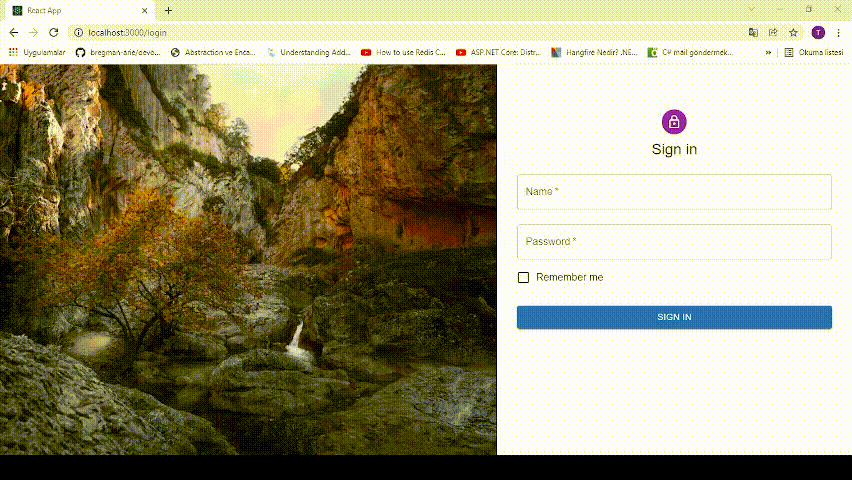

# Site-Yonetimi
Patika &amp; Gelecek Varlık Full Stack Bootcamp Programı Bitirme Projesi
 
React link =>
https://github.com/kemiksizt/Site-Yonetimi-React-/tree/master/kemiksiz-frontend
 
 
 
 

# Projenin Amacı
Sitede bulunan daire, fatura ve kullanıcı bilgilerinin olduğu bir sistemin yönetimi
 
 
 

# YETKILER

<ul>
    <li>Admin kullanıcıları, daireleri ve faturaları görüntüleme, ekleme, silme ve güncelleme yetkilerine sahip. Aynı zamanda admin de bir site sakini. </li>
    <li>Admin bir kullanıcıyı eklediğinde otomatik olarak random 8 karakterli bir şifre atanacak. Kullanıcı daha sonra şifresini değiştirebilecek.
    </li>
    <li>Kullanıcılar yalnızca kendilerine ait olan daire ve fatura bilgilerini görüntüleyebilir. Bilgilere müdehale etme yetkileri yoktur.
    </li>
    <li>Kullanıcılar istedikleri faturalarını toplu veya tek tek ödeme yetkisine sahiptir. Ödemeler yalnızca kredi kartıyla yapılır ve her kullanıcının tek bir kredi kartı olabilir.
    </li>
</ul>

 
 
 

# Proje Hakkında Genel Bilgiler

<ul> 
    <li>Kredi kartı bilgileri için ayrı bir veri tabanı kullanıldı(MongoDB).
    </li>
    <li>Kredi kartı ödemesi eğer kart numarası doğru ve kişiye özel ise ödeme kabul edilir.
    </li>
    <li>Login sonrasında kullanıcının bilgileri token içerisine atıldı.
    </li>
    <li>Web tarafında kullanılmak üzere giriş sonrası kullanıcı bilgisi Cookie ye eklendi.
    </li>
    <li>Kullanıcı belirlenen süreyi doldurmadan Logout yaparsa token bilgisi Cookie içerisinden silinir.
    </li>
    <li>Atama işlemleri için bazı matematiksel hesaplar Extension classının içerisinde yazıldı.
    </li>
    <li>Kredi kartı harici bütün datalar Microsoft Sql Server içerisinde tutuldu.
    </li>
    <li>Yeni gelen kullanıcıya hoşgeldin maili gönderilecek.(Hang Fire)
    </li>
</ul>

 
 
 

# Projeye eklenecek özellikler

<ul>
    <li>Kredi kartı ödemelerinin dökümanı MongoDb üzerinde ayrı bir tablo olarak tutulacak.(Şu anda yalnızca hangi karttan ne kadar çekildi bilgisi tutuluyor.)
    </li>
    <li>Daire ve fatura atamaları şu anda tek tek elle manuel olarak yapılıyor. Otomatize olarak ekleyen servis yazılacak.
    </li>
    <li>Yetkiye göre kontrol için cookie yanında session da aktif olarak kullanılacak.
    </li>
    <li>Projeye extra mesaj özelliği eklenecek, şu anlık mail yoluyla bir etkileşim sağlanıyor.
    </li>
</ul>

 

